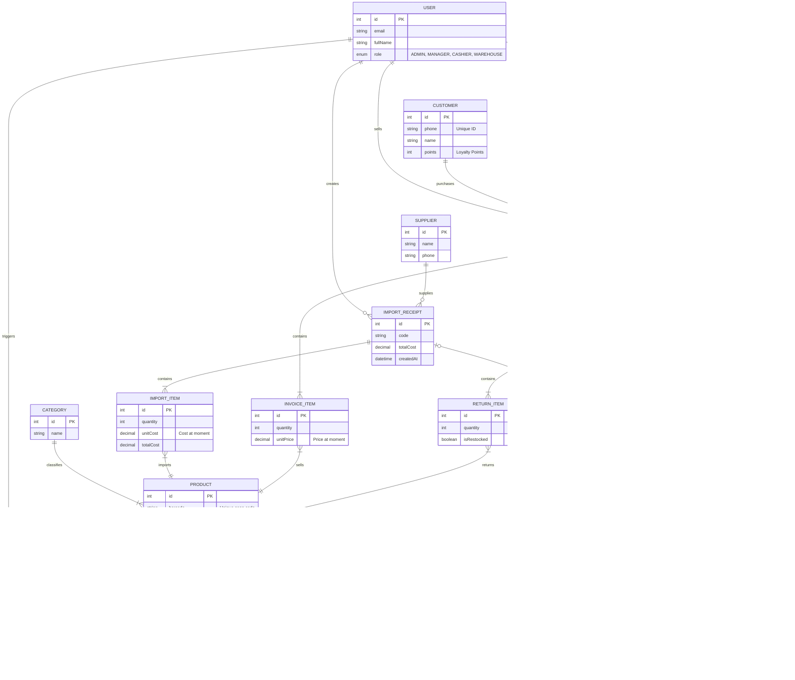

```mermaid
erDiagram
%% ==========================================
%% 1. MASTER DATA (Dữ liệu nền tảng)
%% ==========================================
USER {
int id PK
string email
string fullName
enum role "ADMIN, MANAGER, CASHIER, WAREHOUSE"
}

    CATEGORY {
        int id PK
        string name
    }

    PRODUCT {
        int id PK
        string barcode "Unique scan code"
        string name
        decimal retailPrice "Selling Price"
        decimal importPrice "Cost Price"
        string unit "kg, box, pc"
        float packingQuantity "Units per SKU"
        int stockQuantity "Current Stock"
    }

    SUPPLIER {
        int id PK
        string name
        string phone
    }

    CUSTOMER {
        int id PK
        string phone "Unique ID"
        string name
        int points "Loyalty Points"
    }

    VOUCHER {
        int id PK
        string code
        enum type "%, Fixed"
        decimal value
    }

    %% ==========================================
    %% 2. INVENTORY & IMPORT (Nhập kho & Audit)
    %% ==========================================
    IMPORT_RECEIPT {
        int id PK
        string code
        decimal totalCost
        datetime createdAt
    }

    IMPORT_ITEM {
        int id PK
        int quantity
        decimal unitCost "Cost at moment"
        decimal totalCost
    }

    STOCK_LOG {
        int id PK
        enum changeType "IMPORT, SELL, RETURN, DAMAGE"
        int changeQuantity "+/- value"
        int currentStock "Snapshot"
    }

    %% ==========================================
    %% 3. SALES & SHIFT (Bán hàng & Ca kíp)
    %% ==========================================
    WORK_SHIFT {
        int id PK
        datetime startTime
        datetime endTime
        decimal initialCash
        decimal actualCash
        decimal difference "Audit result"
    }

    INVOICE {
        int id PK
        string code
        decimal totalAmount
        decimal discountAmount
        enum paymentMethod
        datetime createdAt
    }

    INVOICE_ITEM {
        int id PK
        int quantity
        decimal unitPrice "Price at moment"
    }

    %% ==========================================
    %% 4. RETURNS (Đổi trả)
    %% ==========================================
    RETURN_INVOICE {
        int id PK
        decimal refundAmount
        string reason
    }

    RETURN_ITEM {
        int id PK
        int quantity
        boolean isRestocked "Back to shelf?"
    }

    %% ==========================================
    %% RELATIONSHIPS (Quan hệ)
    %% ==========================================

    %% Product & Category
    CATEGORY ||--|{ PRODUCT : "classifies"

    %% User Actions
    USER ||--o{ IMPORT_RECEIPT : "creates"
    USER ||--o{ INVOICE : "sells"
    USER ||--o{ WORK_SHIFT : "works"
    USER ||--o{ STOCK_LOG : "triggers"

    %% Supplier
    SUPPLIER ||--o{ IMPORT_RECEIPT : "supplies"

    %% Customer
    CUSTOMER ||--o{ INVOICE : "purchases"

    %% Voucher
    VOUCHER ||--o{ INVOICE : "applies to"

    %% Import Flow
    IMPORT_RECEIPT ||--|{ IMPORT_ITEM : "contains"
    IMPORT_ITEM }|--|| PRODUCT : "imports"

    %% Sales Flow
    WORK_SHIFT ||--o{ INVOICE : "tracks"
    INVOICE ||--|{ INVOICE_ITEM : "contains"
    INVOICE_ITEM }|--|| PRODUCT : "sells"

    %% Return Flow
    INVOICE ||--o| RETURN_INVOICE : "has return"
    RETURN_INVOICE ||--|{ RETURN_ITEM : "contains"
    RETURN_ITEM }|--|| PRODUCT : "returns"

    %% Stock Log Flow (Audit)
    PRODUCT ||--o{ STOCK_LOG : "has history"
    IMPORT_RECEIPT |o--o{ STOCK_LOG : "sources"
    INVOICE |o--o{ STOCK_LOG : "sources"
    RETURN_INVOICE |o--o{ STOCK_LOG : "sources"
```